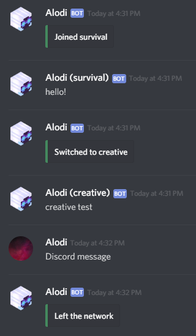

# BungeeDiscord


[](https://discord.gg/26223RR)

<!-- https://img.shields.io/badge/SUPPORT-DISCORD-important.svg?style=for-the-badge -->

**BungeeDiscord** is a Bungee (+Waterfall) plugin that acts as a bridge between any connected Bungee server and a Discord channel.  Features include -
- Extremely simple setup
- Shows player skin as avatar in Discord
- Logs players switching between Bungee servers
- Displays which server the player is sending a message from

## Setup
The `BungeeDiscord.jar` file only needs to be placed in the Bungee server plugins directory.

The plugin operates on a set of "sane defaults", though configuration options will be added as requested.  Any messages sent in game (though **not** commands) are automatically mirrored to Discord, and vice versa.

## Configuration
- Place `BungeeDiscord.jar` in the `plugins` directory on the Bungee server
- Either reload once to generate a default configuration, or create a folder `BungeeDiscord` and within it a file `config.yml` with the following contents:
```yml
token: "someToken"
channelId: "someChannelId"
webhook: "someWebhook"
```

- Modify the file as appropriate
- Start the server

## Usage
The plugin automatically starts on Bungee startup.  There are no commands.

Note that the plugin **very much does not support server reloading**.  It's not recommended practice to reload in any situation, though if reloaded, this plugin will definitely break.

## Support

The best way to get quick support for any Alchemy plugins is through our discord:

[](https://discord.gg/26223RR)

Failing that, use Github issues, and in the worst case, use the Spigot discussions page.

## Screenshots


